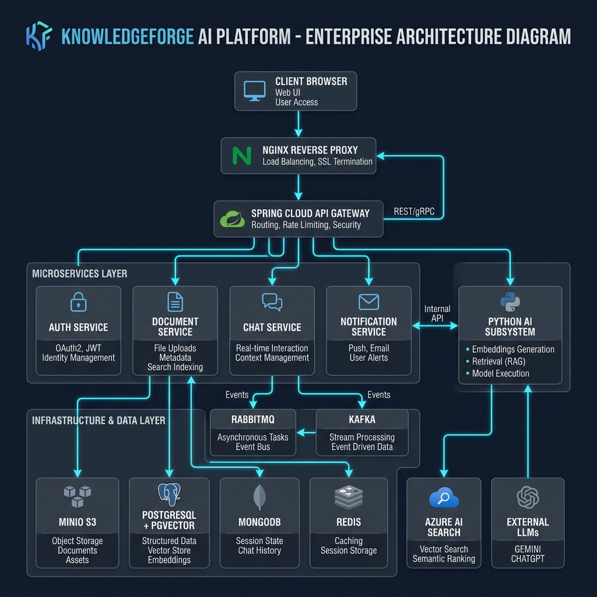
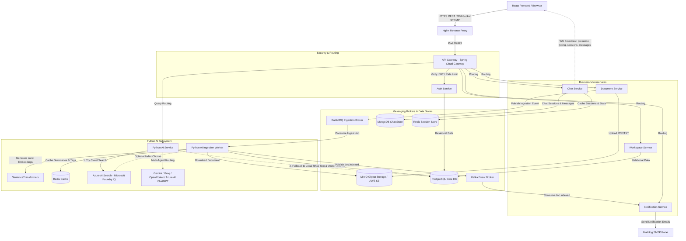

# 🧠 KnowledgeForge AI Platform

[](LICENSE)
[](https://spring.io/projects/spring-boot)
[](https://react.dev/)
[](https://fastapi.tiangolo.com/)
[](https://www.docker.com/)

**KnowledgeForge** is an enterprise-grade, multi-tenant AI Knowledge Platform featuring multi-agent query routing, semantic chunking, high-performance pgvector retrieval, and real-time STOMP WebSocket collaboration. It provides a secure, containerized foundation for organizations to ingest unstructured documents and query them with semantic accuracy, using advanced LLMs (Gemini, Groq, OpenRouter) with built-in fallback mechanisms and compliance controls.

---

## ⚙️ System Architecture

KnowledgeForge is designed as a distributed microservice architecture, utilizing event-driven communication and robust isolation layers to guarantee scalability, low latency, and secure multi-tenant partitioning.

### 🖼️ System Design Architecture

<p align="center">
  
</p>

> [!NOTE]
> Below is the interactive Mermaid schema representing the distributed system architecture and messaging flows.



### Core Services Detailed Breakdown

- **API Gateway (`api-gateway`)**: Built with Spring Cloud Gateway. Coordinates traffic routing, appends Correlation IDs to incoming client requests, runs reactive rate limiters in Redis, and serves as the secure single-entry point to the cluster.
- **Auth Service (`auth-service`)**: Handles secure user registration and login. Enforces BCrypt (strength 12) password hashing, manages rotating JWT access/refresh token lifecycles, integrates **Google OAuth2 Single Sign-On (SSO)**, and executes **Role-Based Access Control (RBAC)** and **Attribute-Based Access Control (ABAC)** rules to block cross-tenant requests and manage workspace access privileges.
- **Document Service (`document-service`)**: Manages file uploads. Reads multipart files, extracts initial metadata, gzips file headers, and stores the raw document streams in MinIO. Once saved, it publishes an ingestion job payload containing the file reference to RabbitMQ.
- **Chat Service (`chat-service`)**: Manages active user chat sessions using SockJS and STOMP WebSocket protocols. It writes and retrieves full message history in MongoDB, implements Redis-backed pub-sub event distribution, and supports real-time workspace collaborator syncing (presence, typing indicators, session renaming, and chat message sync) using `/topic/workspace/{workspaceId}/{presence,typing,sessions,messages}` channels.
- **Workspace Service (`workspace-service`)**: Manages tenant workspace lifecycles, memberships, invitation links, and access rules (collaborator roles, public vs. private workspaces) stored in PostgreSQL.
- **Notification Service (`notification-service`)**: Listens to Kafka events to send document processing status updates and weekly intelligence reports via MailHog, coordinating scheduled executions across instances using Redis-based leader election.
- **Python AI Subsystem (`python-ai-service` & `python-ai-worker`)**: High-performance FastAPI modules executing LangChain workflows. The worker consumes RabbitMQ events to process files, while the service answers user questions by querying LLMs.

---

## Core Features

- **Multi-Tenant Isolation**: Complete partitioning of workspaces. All documents, vector embeddings, and chat histories are isolated at the database layer using indexed `workspace_id` columns and strict user-workspace validation filters.
- **Integrated Google OAuth2 & SSO**: Native support for secure, passwordless authentication using Google Single Sign-On, operating alongside local email-password credentials verified via JWT tokens.
- **Read-Only Public Guest Demo**: Allows users to instantly interact with the workspace chats and explore the RAG features in a secure, read-only guest state without requiring initial login or registration.
- **Dynamic Hybrid Search & Fallback**: Standard configuration uses Azure AI Search (Microsoft Foundry IQ) for cloud vector search. If the cloud search client encounters network errors, API limits, or configuration issues, the query engine automatically falls back to its local vector retrieval pipeline (PostgreSQL with `pgvector` dense indexes) to ensure uninterrupted service.
- **Multi-Agent Query Routing**: Supports intelligent routing of user questions to multiple LLMs (Google Gemini 1.5/2.5, Groq Mistral/Llama, OpenRouter models, and ChatGPT models deployed via Microsoft Foundry IQ / Azure AI Projects) with automatic failovers.
- **Real-time Performance & Collaboration**: Powered by SockJS and STOMP WebSockets backed by Redis:
  - **Multiplayer Presence Tooltips**: Live collaborator lists sync instantly across sessions, showing active user avatars with tooltips displaying their display name and email.
  - **Workspace-Scoped Typing Alerts**: Co-presence typing indicators notify the team when colleagues are active, formatting indicators dynamically from singular (*User is typing...*) to plural (*User1, User2 are typing...*).
  - **Collaborative Message Sync**: Message exchanges and streaming AI answers update instantly on all active collaborator screens viewing the same chat session.
  - **Self-Echo Suppression & Renames**: Real-time session additions, deletions, and auto-renaming synchronize seamlessly without duplicate items.
  - **Collapsible Sessions Sidebar**: An adaptive side navigation panel toggles to maximize the chat workspace on lower-resolution screens.
  - **Real-Time Service SLA Monitoring**: Displays a live connection monitor showing `100% SLA` or `SLA Degraded` based on active gateway and service health.
- **Theme & i18n**: Premium custom UI with complete dark/light mode toggles and bilingual support (English and Hindi localization) for all headers, dropdowns, welcome screens, and workspaces.
- **Insights Dashboard & Data Export**: A dedicated workspace analytics dashboard displaying document processing statistics, extracted summaries, automated entity tagging, and workload correlation metrics, complete with built-in data export capability.
- **Document Catalog Audit Trail**: Ingested files track and display the specific user who uploaded them in both English and Hindi tables, providing strong data compliance.
- **Model Context Protocol (MCP) Tooling**: Integrates native Model Context Protocol (MCP) standards. Cloud-based LLMs deployed via the Azure AI Projects SDK are configured with an `MCPTool` that calls the FastAPI microservice (`/knowledgebases/{workspace_id}/mcp`) dynamically to fetch vector-grounded text chunks.
- **Security Scanning & Compliance**: Zero hardcoded secrets. All sensitive keys are loaded strictly from the environment, and credentials in the template `.env.example` are kept generic.

---

## 🤖 Multi-Agent Reasoning Subsystem

The Python AI service (`python-ai-service`) orchestrates a network of 11 specialized, decoupled reasoning agents to handle input validation, query rewrites, context ranking, compliance routing, and response synthesis:

- **Pipeline Orchestrator Agent** (`pipeline_orchestrator_agent.py`): The core supervisor routing engine coordinating execution across all specialized sub-agents.
- **Input Guardrail Agent** (`input_guardrail_agent.py`): Sanitizes queries, blocks prompt injections/jailbreaks, checks toxicity, and redacts PII (SSNs, cards, phones).
- **Query Rewriter Agent** (`query_rewriter_agent.py`): Reformulates conversational context into standalone search queries optimized for vector databases.
- **Multi-Query Retrieval Agent** (`multi_query_retrieval_agent.py`): Generates search variations to maximize vector lookup coverage.
- **ReRanker Agent** (`reranker_agent.py`): Evaluates retrieved chunks, scoring and sorting them by relevance to drop low-quality contexts.
- **Context Compressor Agent** (`context_compressor_agent.py`): Compresses and filters retrieved vector contexts to fit token window limits.
- **Answer Agent** (`answer_agent.py`): Synthesizes the final response using the compressed context and generates citation hooks.
- **Output Guardrail Agent** (`output_guardrail_agent.py`): Sanitizes generated answers, verifies source citations, and prevents out-of-bounds tags or hallucinations.
- **Explainability Agent** (`explainability_agent.py`): Generates detailed reasoning diagnostics showing users exactly how their answers were compiled.
- **Insight Generation Agent** (`insight_generation_agent.py`): Processes newly ingested documents post-upload to extract automated summaries, tags, and key entities.
- **Report Generation Agent** (`report_generation_agent.py`): Synthesizes tenant workload and focus statistics to compile intelligence reports.

---

## Ingestion & Chunking Pipeline

### Document Processing Lifecycle

1. **Document Upload**: The user uploads a PDF or TXT document through the React frontend, which sends a request to the API Gateway.
2. **File Storage**: The API Gateway forwards the request to the Document Service, which uploads the file stream to MinIO object storage.
3. **Queue Notification**: Once successfully stored, the Document Service publishes a file metadata event to the RabbitMQ broker.
4. **Ingestion Worker**: The Python Ingestion Worker (`python-ai-worker`) consumes the event from RabbitMQ, downloads the document from MinIO, and starts the text extraction process.
5. **Chunking Strategy**: A semantic-based sliding window algorithm splits the text into chunks of 500 words with a 50-word overlap.
6. **Embeddings & Local Storage**: The worker generates vector embeddings for each chunk using a local `sentence-transformers` model (`all-MiniLM-L6-v2`). The text chunks and their dense embeddings are saved to PostgreSQL (using the `pgvector` extension) for persistence and local retrieval fallback.
7. **Cloud Search Indexing (Optional)**: If `USE_FOUNDRY_IQ` is enabled, the worker also indexes the chunks in Azure AI Search (Microsoft Foundry IQ).
8. **Analysis Generation**: The worker calls the Gemini API to generate document summaries and key entity tags, caching them dynamically in Redis.

---

## Tech Stack

- **Frontend**: React (v18), Vite, Material-UI (MUI), i18next, SockJS, STOMP.js.
- **Java Backend**: Spring Boot 3.2, Spring Cloud Gateway, Spring Security (including Spring Security OAuth2 Client), JWT, JPA/Hibernate.
- **Python Backend**: FastAPI, LangChain, SentenceTransformers (`all-MiniLM-L6-v2`), PyMuPDF, Pydantic.
- **Cloud AI & LLM Providers**: Google Gemini (Gemini 1.5/2.5 Flash), Groq (Mistral, Llama 3), OpenRouter (API gateway fallback), and Microsoft Foundry IQ / Azure AI Project ChatGPT (GPT-5-mini).
- **Enterprise Search & Projects**: Azure AI Search (Microsoft Foundry IQ) and Azure AI Projects (ChatGPT deployments).
- **Databases & Caches**: PostgreSQL (with `pgvector` extension), MongoDB, Redis (with RedisInsight UI).
- **Message Brokers**: RabbitMQ, Kafka, Zookeeper.
- **Infrastructure**: MinIO Object Storage (AWS S3 compatible), MailHog SMTP, Nginx.

---

## System Design & Architectural Patterns

KnowledgeForge is implemented adhering to industry-standard system design patterns and architectural principles:

- **Saga Pattern (Choreography-based)**: Used to coordinate the distributed file ingestion workflow. The transaction begins in `document-service` (storing the file in MinIO), transitions to RabbitMQ via event publishing, and is consumed by `python-ai-worker` which performs chunking, embedding generation (stored in Postgres `pgvector`), and analysis (cached in Redis). This decoupling ensures eventual consistency across databases without synchronous blocking calls.
- **SOLID Principles**:
  - _Single Responsibility Principle (SRP)_: Strictly followed in Spring Boot and Python controllers, services, and repositories. For example, `AuthFilter` handles only gateway-level routing security, while `auth-service` manages token lifecycles and registration.
  - _Open/Closed Principle (OCP)_: The Python AI query routing subsystem uses an abstract LLM interface wrapper. Adding a new LLM provider or search index requires adding a new concrete implementation class rather than modifying the core routing controller.
  - _Dependency Inversion Principle (DIP)_: High-level business logic services depend on interfaces and abstract repositories (using Spring `@Autowired` and FastAPI `Depends` injection) rather than directly instantiating database connections or API clients.
- **Builder Pattern**: Extensively utilized across all Spring Boot microservices (using Lombok `@Builder`) to construct DTOs, logs, and database entities dynamically.
- **Active/Passive Scheduler (Leader Election)**: Utilized in `notification-service` to ensure that only a single instance of the service executes the weekly cron logging and workspace activity report generation when running in a scaled horizontal environment.
- **Workspace Segregation (Multi-Tenancy)**: Employs shared-database multi-tenancy. Workspace routing and data filtering are governed by tenant ID validation, partitioning MongoDB collections, MinIO buckets, and PostgreSQL tables.

---

## Local Setup & Configuration Guide

Follow this guide to configure, build, and run the KnowledgeForge platform locally.

### Prerequisites

- **Docker & Docker Desktop** (v20.10+ / Compose v2.0+)
- **Node.js** (v18+ or v20+) & **npm**
- **Git**

---

### Step 1: Environment Variables Configuration

Duplicate the example environment file in the project root:

```bash
cp .env.example .env
```

Open the newly created `.env` file and configure the parameters. Below is a detailed mapping of the critical keys:

| Environment Variable              | Description                                        | Source / Local Default                  |
| :-------------------------------- | :------------------------------------------------- | :-------------------------------------- |
| `GEMINI_API_KEY`                  | Key for Google Gemini 1.5/2.5 models               | Google AI Studio                        |
| `GROQ_API_KEY`                    | Key for Groq Mistral/Llama models                  | Groq Console                            |
| `OPENROUTER_API_KEY`              | Key for OpenRouter API fallback models             | OpenRouter                              |
| `GOOGLE_CLIENT_ID`                | Client ID for Google OAuth2 Single Sign-On (SSO)   | Google Cloud Console API Credentials    |
| `GOOGLE_CLIENT_SECRET`            | Client Secret for Google OAuth2 Single Sign-On     | Google Cloud Console API Credentials    |
| `JWT_SECRET_KEY`                  | HMAC-SHA256 signature key for JWT tokens           | User-defined 32-byte hex string         |
| `AWS_ACCESS_KEY_ID`               | Access key for local MinIO S3 object storage       | User-defined access key                 |
| `AWS_SECRET_ACCESS_KEY`           | Secret key for local MinIO S3 object storage       | User-defined secret key                 |
| `AWS_REGION`                      | Region parameter for MinIO S3 bucket               | User-defined region                     |
| `SPRING_MAIL_HOST`                | SMTP server host for notifications                 | User-defined SMTP host                  |
| `SPRING_MAIL_PORT`                | SMTP port                                          | User-defined SMTP port                  |
| `SPRING_PROFILES_ACTIVE`          | Active profile for Spring Boot microservices       | Active profiles (e.g., `prod`, `dev`)   |
| `USE_FOUNDRY_IQ`                  | Toggle to enable Microsoft Foundry IQ cloud search | `true` or `false`                       |
| `AZURE_AI_SEARCH_ENDPOINT`        | Endpoint URL for Azure AI Search                   | Azure AI Studio / Azure Portal          |
| `AZURE_AI_SEARCH_KEY`             | Access key for Azure AI Search                     | Azure AI Studio / Azure Portal          |
| `AZURE_AI_PROJECT_ENDPOINT`       | Endpoint connection string for Azure AI Project   | Azure AI Studio Project Settings        |
| `AZURE_AI_MODEL_DEPLOYMENT_NAME`  | Name of model deployment (e.g., `gpt-5-mini`)      | Azure AI Studio Deployment Name         |

> [!NOTE]
> **MinIO & AWS S3 Compatibility**: The object storage configuration is fully compatible with standard S3 protocols. While **MinIO** is used for local offline development, you can replace the credentials and endpoint in `.env` with a production **AWS S3** bucket and credentials without modifying any application code.

---

### Step 2: Spin Up Infrastructure and Microservices

Build and run the entire containerized stack using Docker Compose. In the project root, run:

```bash
docker-compose up --build -d
```

This starts all 14 containers in the background, including the relational and vector databases, message brokers, caching nodes, Java microservices, and Python AI processors:

- Core Databases: `kf-postgres`, `kf-mongodb`
- Cache & Object Stores: `kf-redis`, `kf-minio`
- Message Brokers: `kf-rabbitmq`, `kf-kafka`, `kf-zookeeper`
- Core Services: `kf-auth-service`, `kf-document-service`, `kf-chat-service`, `kf-workspace-service`, `kf-notification-service`
- AI Subsystems: `kf-python-ai-service`, `kf-python-ai-worker`
- Gateways: `kf-api-gateway`, `kf-nginx`

**Database Auto-Initialization & Seeding**:

- **PostgreSQL (`kf-postgres`)**: Automatically initializes the database schema, installs the `pgvector` extension, and inserts core tables using `./infra/db/init.sql`.
- **MongoDB (`kf-mongodb`)**: Collections and schemas are initialized dynamically by the `chat-service` on startup.
- **Automated Public Guest Seeding**: The `kf-python-ai-service` container automatically runs the Python seeder (`python -m app.seed_guest_data`) on startup. It loads the `all-MiniLM-L6-v2` embedding model, generates 384-dimensional vector embeddings for the files inside the `/synthetic-data/` directory, and populates the **Public Guest Workspace** (`00000000-0000-0000-0000-000000000000`) for immediate RAG chat testing.
  - *Optional Manual Re-Run*: If you ever clear your databases and need to manually re-seed, run:
    ```bash
    docker exec -it kf-python-ai-service python -m app.seed_guest_data
    ```

**`/synthetic-data/` Folder Contents**:
Contains sample datasets that you can upload to any custom workspace to test dynamic ingestion, chunking, and search:
- `synthetic_engineering_certification_guide.txt` (DevOps & Cloud Engineer tracks)
- `synthetic_team_learning_report.txt` (Study completion averages)
- `synthetic_workload_insights_report.txt` (Meeting vs. focus hours correlation)
- Activity & learner performance JSON models (`synthetic_learner_performance.json`, etc.)

---

### Step 3: Run the React Frontend Workspace

Navigate to the `frontend` folder, install the dependency node modules, and launch the Vite development server:

```bash
cd frontend
npm install
npm run dev
```

The frontend application will boot up at **`http://localhost:5173`**.

---

### Step 4: Verification & Developer Dashboards

Verify that all containers are running successfully and healthy:

```bash
docker-compose ps
```

You can access the various local administrative dashboards and service monitoring panels using the ports below:

| Dashboard / Service Console     | Local URL                                                                      |
| :------------------------------ | :----------------------------------------------------------------------------- |
| **Vite Frontend App**           | [http://localhost:5173](http://localhost:5173)                                 |
| **API Gateway Actuator**        | [http://localhost:8080/actuator/health](http://localhost:8080/actuator/health) |
| **MailHog Outbox Viewer**       | [http://localhost:8025](http://localhost:8025)                                 |
| **RedisInsight Console**        | [http://localhost:8001](http://localhost:8001)                                 |
| **MinIO Storage Dashboard**     | [http://localhost:9001](http://localhost:9001)                                 |
| **RabbitMQ Management Console** | [http://localhost:15672](http://localhost:15672)                               |

> [!NOTE]
> **Kafka & Zookeeper Consoles**: Apache Kafka and ZooKeeper run as headless infrastructure components on their respective TCP ports (`9092` and `2181`) inside the Docker Compose network. They do not expose web-based management consoles in this default configuration.

---

## 📊 System SLAs, SLOs, and SLIs

KnowledgeForge targets carrier-grade reliability metrics:

- **Service Level Indicators (SLIs)**:
  - Cosine similarity search latency (database query).
  - Ingestion processing duration (time from document upload to processing completion).
  - LLM response token stream duration.
- **Service Level Objectives (SLOs)**:
  - `p95` query response latency (including context retrieval and Gemini streaming) **< 5.0 seconds**.
  - `p99` JWT verification duration at the gateway **< 200ms**.
  - `p90` ingestion worker chunking and embedding generation for a standard 10-page PDF **< 8.0 seconds**.
- **Service Level Agreement (SLA)**:
  - Target of **99.5%** monthly platform availability.

---

## 🔒 Security & Standards Compliance

KnowledgeForge is aligned with industry-standard secure coding and operational guidelines:

### OWASP Top 10 Mitigations

- **A01: Broken Access Control**: Strict workspace ownership verification handled by the backend's `PolicyService` and gateway security filters.
- **A02: Cryptographic Failures**: User passwords hashed using BCrypt (strength 12). JWT signatures encrypted via HMAC-SHA256. Cookies set with `HttpOnly`, `Secure`, and `SameSite=Strict`.
- **A03: Injection**: All SQL operations use Spring Data JPA parameterized queries. Python FastAPI requests are sanitized through input length and regex constraints.
- **A04: Insecure Design**: Default multi-tenant data segregation. Shared workspaces require explicit permission keys.
- **A05: Security Misconfiguration**: No default exposed admin ports. External production variables are injected dynamically.

### NIST SP 800-53 Control Mapping

- **AC-2 (Account Management)**: User lifecycle and signup policies enforced by `auth-service`.
- **AC-3 (Access Enforcement)**: Dynamic workspace membership checking at both document retrieval and chat message layers.
- **AU-2 (Event Logging)**: Audit logs tracking authentication, document ingestion, and configuration changes are written to the database.
- **IA-2 (Identification & Authentication)**: Standardized OAuth2 (Google) and JWT-based authentication.
- **SC-8 (Transmission Integrity)**: End-to-end data encryption in transit via Nginx SSL/TLS configuration.

---

## 📄 License

This project is licensed under the MIT License. See the [LICENSE](LICENSE) file for details.
